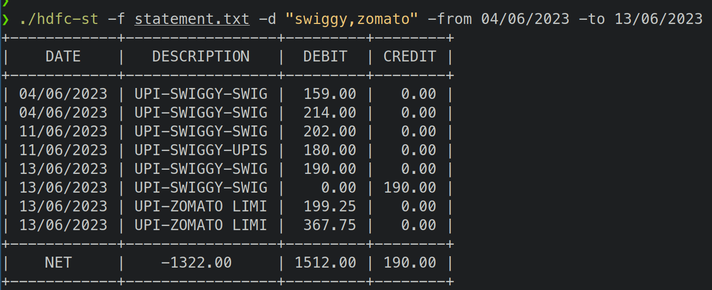

# hdfc-st
A command-line tool to print data from HDFC bank CSV statement files.




## Usage:
```
./hdfc-st -f file | - [-d text to match] [-x text to exclude] [-on dd/mm/yyyy] | [-from -after dd/mm/yyyy]
  -cred
    	print credits
  -d value
    	description to match, comma separated
  -deb
    	print debits
  -f string
    	statement text file | - stdin
  -from value
    	transactions from specified date
  -net
    	print net
  -on value
    	transactions on specified date
  -to value
    	transactions till specified date
  -x value
    	descriptions to exclude, comma separated

```

## Features

* Filter by
    * Matching description(case-insensitive)
    * Excluding description(case-insensitive)
    * On specific date
    * Between dates

* Table formatted
* Show credits, debits and net


## Example

```
hdfc-st -f statement.txt -from 20/07/2023 -to 22/07/2023 -d "swiggy"

```


## Building
```
go build
```
